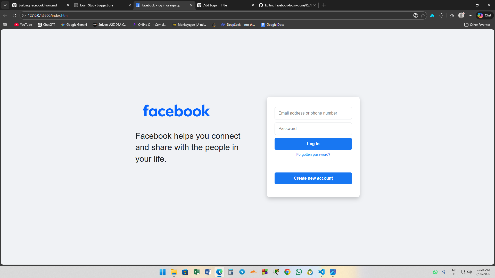

# Facebook Login Page Clone

## Description
This project is a **front-end clone of Facebook’s login page**, built entirely with **HTML and CSS**. It replicates the layout, colors, and form design of the original interface, including the login form, “Create new account” button, and responsive design for mobile and desktop. The purpose of this project is to practice **HTML structure, CSS styling, and responsive UI design** by creating a realistic web page clone.

## Preview


## How to Run
1. Clone the repository:
```bash
git clone https://github.com/yourusername/facebook-login-clone.git
